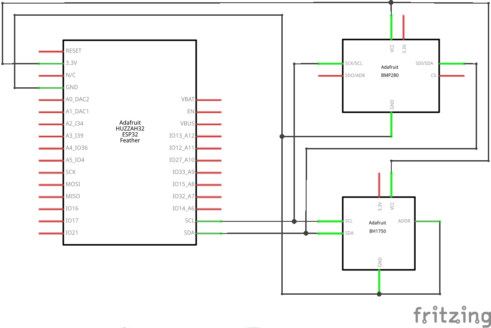
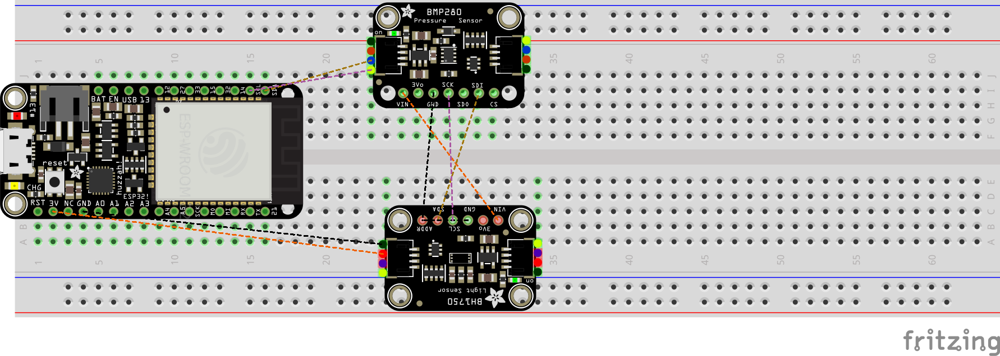

# Thomas More - IT Essentials - Project: Weather Station

This is a project that has been assigned by the teachers of the course IT Essentials at Thomas More Campus Geel to us.
The purpose is to teach us some IoT things and provide us with practical experience.

## Overview
The project consists out of 3 main parts.
- Adafruit ESP32 Feather
  
  This is the development board that we will be using.
- BMP280

  This is a Adafruit BMP280 breakout board which contains the Bosch BMP280 pressure and temperature sensor. This is being controlled through the I2C bus.

- BH1750

  This is a Adafruit BH1750 breakout board which contains a light sensor. This is being controlled through the I2C bus.

The following picture is made by me to show the setup that we're talking about here.

## Hardware
Since we're using multiple components, we have to design a wiring diagram. I have done this using Fritzing.

I have also created a breadboard layout for reference.

## Software
I already have quite a bit of experience with C++, which is why I have completely over-engineered this small weather station.
I have divided everything up into small building blocks. The sensors have their own respective classes in their own folder.
The wireless functionality is hidden away, and so is the MQTT functionality.

I have also created a config file for ease of use. You can find this as `config.example.h`.
To use it, you will need to make a copy and rename it to `config.h`, and complete the values with your own credentials.

## Conclusion
This was a fun project to do, especially since it involved communications and programming as well as a hardware side.